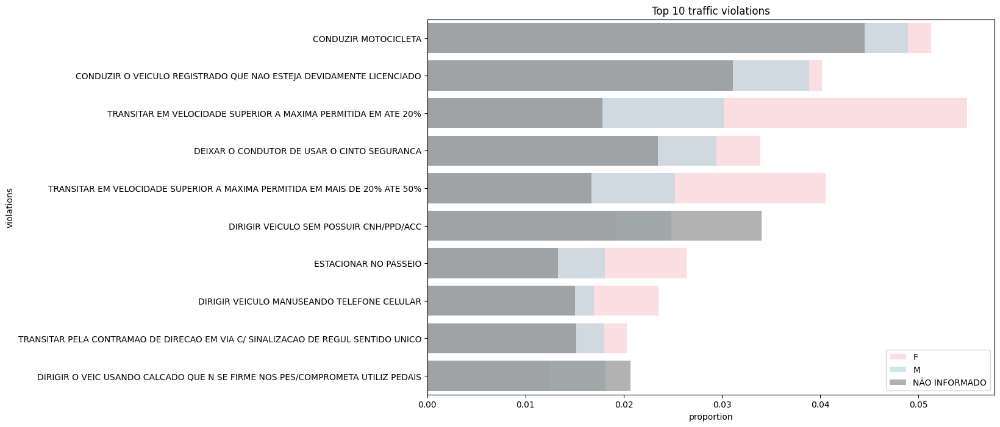

# ✨ EDA | Traffic Violation Patterns: A Gender-Based Analysis (RJ, 2024)

I conducted an Exploratory Data Analysis (EDA) to investigate traffic violation patterns by gender, using official 2024 data from the Rio de Janeiro government.

I used the book [Practical Statistics for Data Scientists](https://www.amazon.com.br/Practical-Statistics-Data-Scientists-2e/dp/149207294X/ref=asc_df_149207294X?mcid=96253c8c2de5319082dbeaf3d8555fcc&tag=googleshopp00-20&linkCode=df0&hvadid=709872820935&hvpos=&hvnetw=g&hvrand=10831861814973397601&hvpone=&hvptwo=&hvqmt=&hvdev=c&hvdvcmdl=&hvlocint=&hvlocphy=9221000&hvtargid=pla-913779307193&psc=1&language=pt_BR&gad_source=1) to make a contigency table to analyze the gender in the top 10 traffic violations occured in 2024 in Rio de Janeiro.

Note: The plot doesn't measure the total quantity of infractions between men and women; instead, it shows the proportion of infractions within each gender. For females, the most common infraction was speeding, while for males, motorcycle-related infractions were more prevalent—such as riding without a license or with an unlicensed vehicle.

The analysis shows that a significant portion of violations among women is related to speed limits. This deserves attention from traffic authorities, as speeding poses a high risk to everyone. Men, on the other hand, have a higher frequency of motorcycle-related infractions. This aligns with local observations in Rio de Janeiro, where risky riding behavior among men is unfortunately common.

This project was an excellent opportunity to apply data science theory to a real-world dataset, improving my skills in data cleaning, statistical inference, and storytelling.